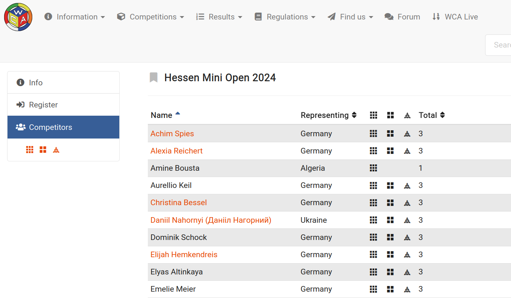
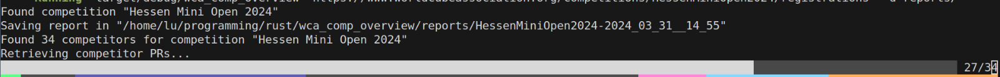
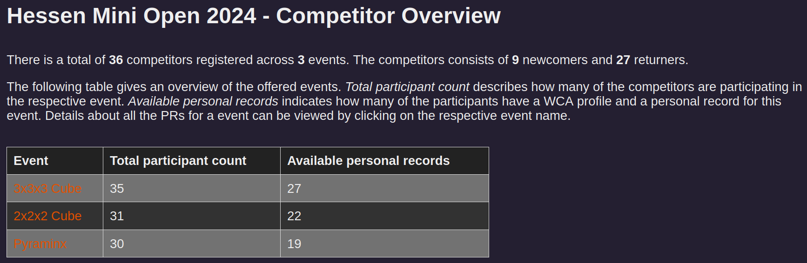
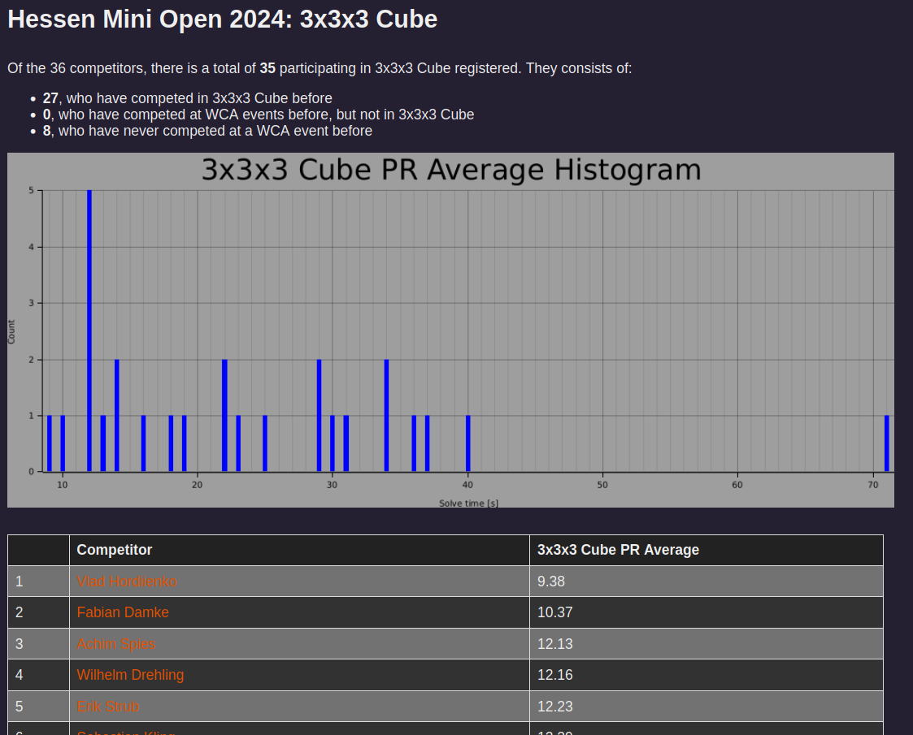
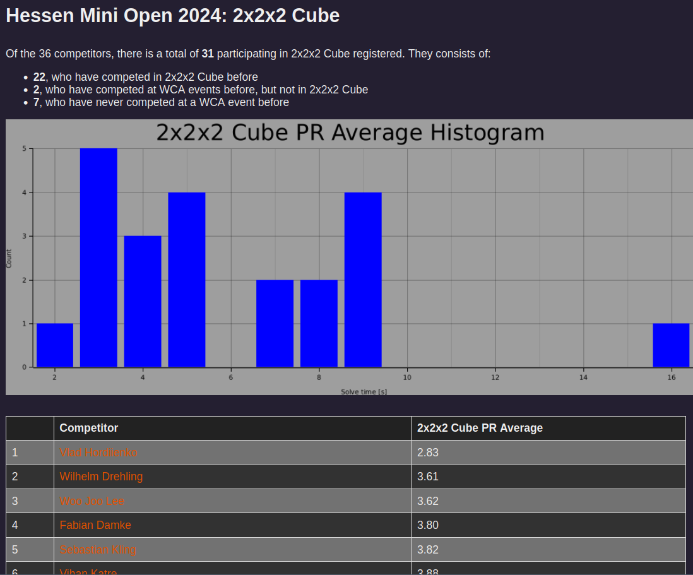
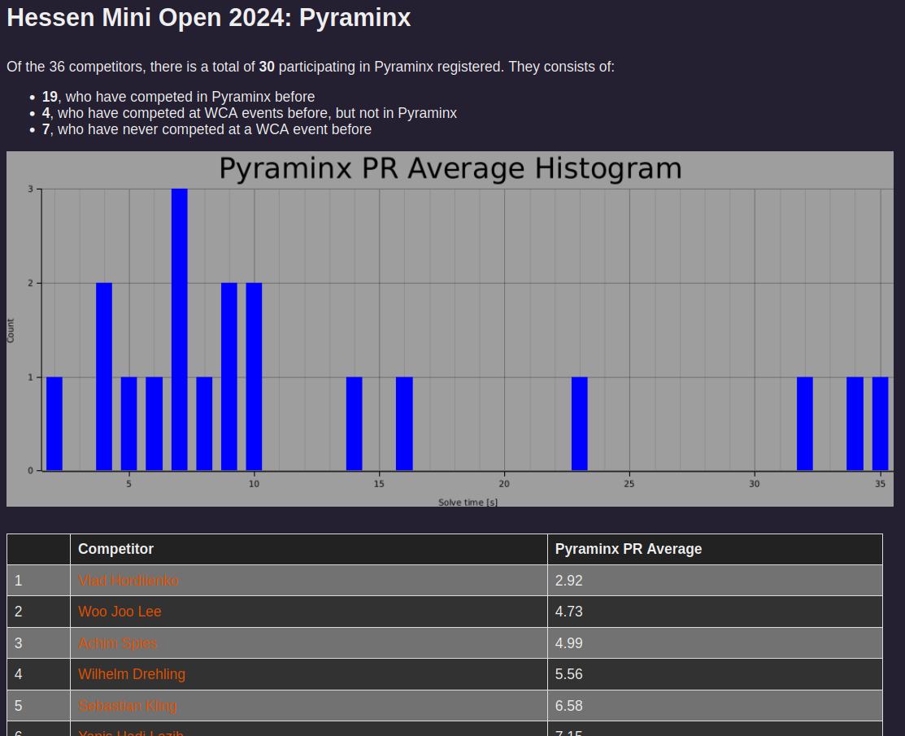

# wca_comp_overview
**wca_comp_overview** is a tool to learn about the competitor field of upcoming WCA ([World Cubing Association](https://www.worldcubeassociation.org/)) competitions.

The WCA website provides the list of registered competitors and which events they are participating in:



It is possible to click on competitors who have competed before and few their past results.
With competitions often having a hundred or more competitors, it is impractical to manually browse the WCA profiles to get an overview of the skill distribution of the competitor field.

**wca_comp_overview** uses the available data and automated processing to generate a report about the personal records (PRs) of the competitors in each event.

## Installation
Currently, the only option for installation is cloning this repository and building it yourself.
This requires a local [rust installation](https://www.rust-lang.org/tools/install).
```
$ git clone https://github.com/lbeierlieb/wca_comp_overview.git
$ cd wca_comp_overview
$ cargo build --release
```

## Usage
### Basic usages
Pass the URL to the registrations page of an upcoming competition.
```
$ wca_comp_overview <URL to registrations page>
```
For example: 
```
$ wca_comp_overview https://www.worldcubeassociation.org/competitions/HessenMiniOpen2024/registrations
```
Note: HessenMiniOpen2024 will take/takes/took place at May 10th, 2024. Afterwards, this registrations page will not be available anymore.

The application will load and parse the competitors from the page and then load their PRs.
This can take a while, so a progress bar displays the status.



A html-based report is generated and by default stored in the current directory.
Automatically, the default system browser is called to open the overview page.



By clicking on the event name in the table, a dedicated page opens for this event, as displayed in the following three images.







### Commandline options
| short    | long    | description    |
|---------------- | --------------- | --------------- |
| `-h`         | `--help`       | Show information about commandline options.    |
| `-d`         | `--destination-directory`       | Specify an existing folder that to report should be saved in. If not specified, the current working directory is used.    |
| `-s`         | `--source`     | Pass `unofficialapi` to load PR data from the unofficial WCA API hosted on [github](https://github.com/robiningelbrecht/wca-rest-api). Tends to be the faster option but might not be perfectly up to date (updated once a day). Pass `wcawebsite` to retrieve PRs from the WCA website directly. `unofficialapi` is used by default.   |
| `-n`         | `--no-browser` | Do not open the generated report in the default system browser.|

## Limitations
Currently, the WCA events **3x3x3 Fewest Moves** and **3x3x3 Multi-Blind** are ignored, because their scores differ from the others' "Solve time, the faster the better".
Supporting them requires special handling in a few places, which is currently not implemented but might be added in the future.
