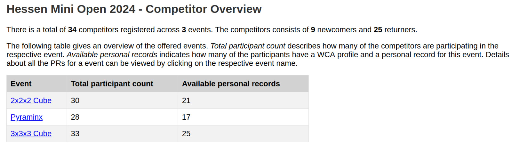
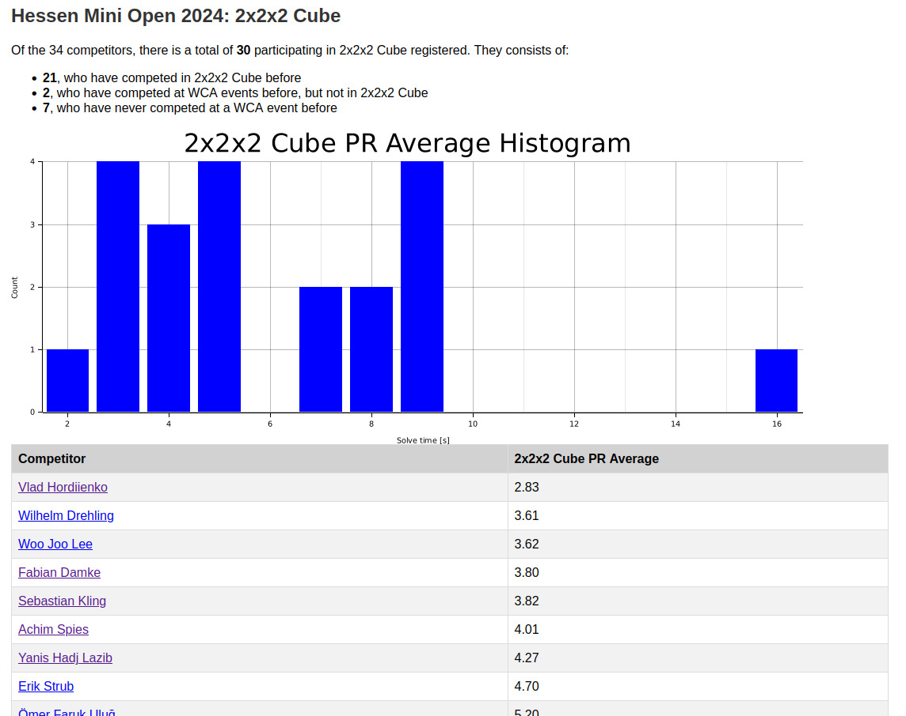
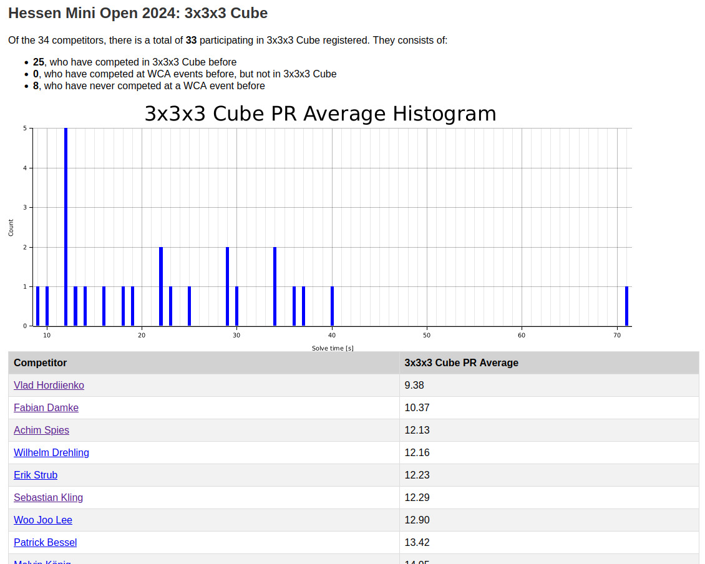
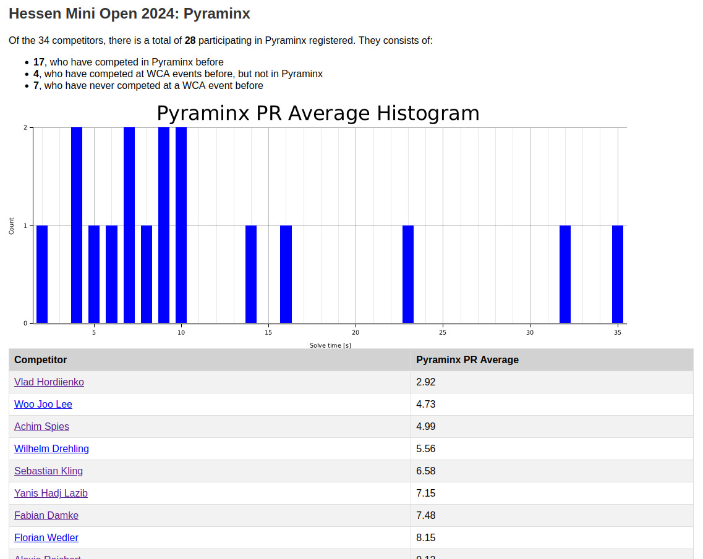

# wca_comp_overview
**wca_comp_overview** is a tool to learn about the competitor field of upcoming WCA ([World Cubing Association](https://www.worldcubeassociation.org/)) competitions.

The WCA website provides the list of registered competitors and which events they are participating in:


It is possible to click on competitors who have competed before and few their past results.
With competitions often having a hundred or more competitors, it is impractical to manually browse the WCA profiles to get an overview of the skill distribution of the competitor field.

**wca_comp_overview** uses the available data and automated processing to generate a report about the personal records (PRs) of the competitors in each event.

## Usage
### Basic usages
Pass the URL to the competitor page of an upcoming competition.
```
$ wca_comp_overview <URL to WCA competitor page>
```
For example (HessenMiniOpen2024 will take/takes/took place at May 10th, 2024. Afterwards, the competitor page will not be available anymore)
```
$ wca_comp_overview https://www.worldcubeassociation.org/competitions/HessenMiniOpen2024/registrations
```
The application will load and parse the competitors from the page and then load their PRs.
This can take a while, so a progress bar displays the progress.


A html-based report is generated and by default stored in the current directory.
Automatically, the default system browser is called to open the overview page.



By clicking on the event name in the table, a dedicated page opens for this event, as displayed in the following three images.







### Commandline options
TODO
